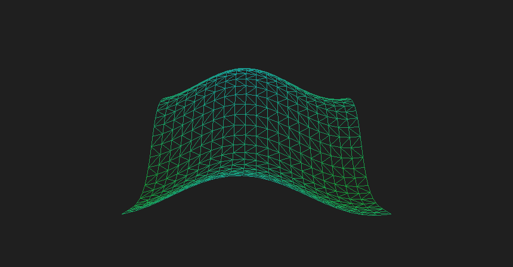

# Vertexshader-effect
Testing different vertex shader effects on a triangle strip grid using OpenGL/LWJGL to interface with the GPU
## Demonstration:
</img>
## Notes:
 - Project is meant to stress test various aspects of OGL, including vertex shader effects, fragment shader effects, as well as post processing using FrameBuffers/RenderBuffers, hopefully with a configureable kernel.
 - To run it from within the IDE, you'll need to have LWJGL installed and set as a build path within the project. To do so, visit LWJGL.org and download their latest version. Then within your IDE, add it as an external library (In eclipse, right click the project: Properties -> Java Build Path -> Add External Jars -> Add every jar from the LWJGL file you downloaded.) Then once the errors disappear, it should be good to run.
